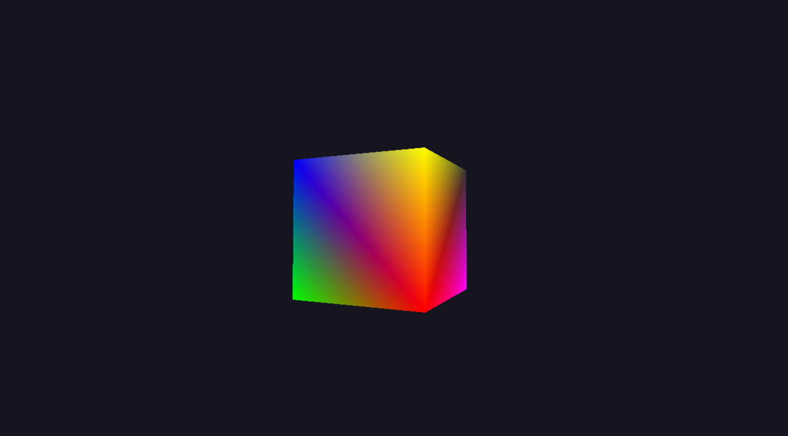
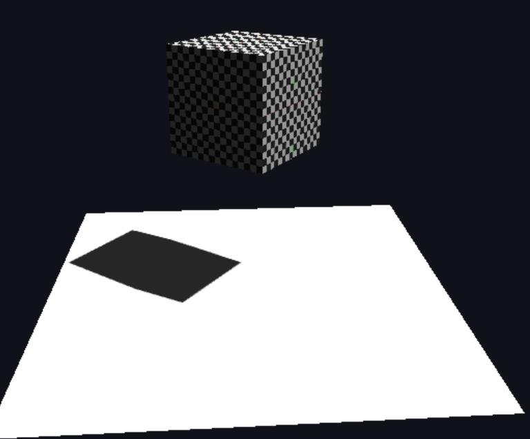
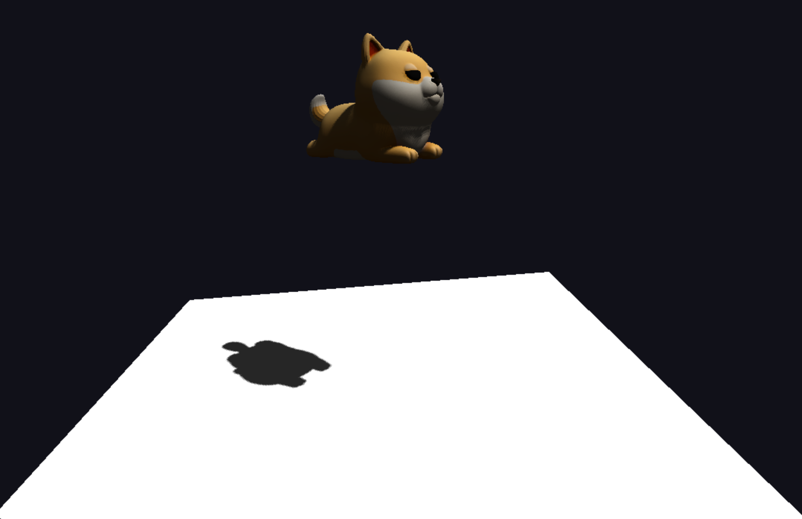

# 软件光栅化器（C++/SDL2/GLM）

一个支持 OBJ/纹理、透视 UV、Lambert 光照、阴影贴图与地面的软件渲染器。
- **显示模式**：Shaded / UV / Depth（按 `M` 切换）
- **控制**：鼠标观察（TAB 捕获/释放）、WASD/QE 移动、L 光照、H 阴影、B 双线性、C 背面剔除、ESC 退出

## 依赖（示例：vcpkg on Windows）
vcpkg install sdl2:x64-windows glm:x64-windows stb:x64-windows
## 构建
cmake -S . -B build -DCMAKE_BUILD_TYPE=Release
cmake --build build --config Release
## 运行
./build/bin/rasterizer [model.obj] [texture.png]
未提供纹理则自动生成棋盘；未提供 OBJ 则展示旋转立方体；始终添加地面以显示阴影
## 截图




